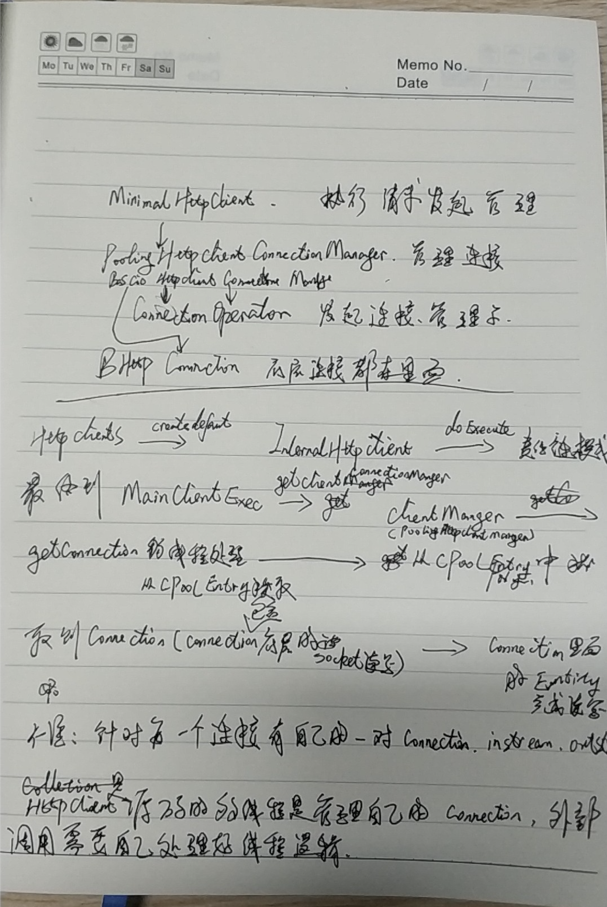

1. HttpParams中的ConcurrentHashMap，这是支持并发类型的map，内部逻辑结构类似于hashmap，不同的是数组是16个segement组成并且不能够扩容，segement继承ReentrantLock来加锁，由于只有16个segement，理论上支持16个线程同时并发处理，每个segement数组元素内是一个链表结构，也是entry，这个链表时可以扩容的，当capacity * loadsize > 阈值进行扩容

2. HttpRequestExecutor  http请求调度这，参与连接整个过程

3. ClientConnectionManager 客户端连接管理者，参与client的连接器clientConnection以及poolentry；后面这个不知道具体干啥

4. HttpHost 包含了访问目的服务器、端口号、域名前缀http等信息
   HttpRoute 和上面有点类似，但是比它更详细，route包含本地、服务端的地址信息，同时也包含隧道、链路和安全等信息


5. RequestWrapper是对HttpRequest的再次封装，估计目的是标准化，内部包含访问方法、版本、地址还有执行次数等信息，httprequest是开放给用户自定义

6. AbstractHttpClientConnection里面成员SessionInputBuffer、SessionOutputBuffer是底层的输入输出流,这两个成员是在其子类DefaultHttpClientConnection和DefaultClientConnection里面完成定义的,其bindSocket方法完成初始化

7. BasicClientConnectionManager里面两个重要成员HttpPoolEntry poolEntry; ClientConnectionOperator connOperator;后者内部方法createConnection创建上面的DefaultClientConnection实例,并把这个值赋给了HttpPoolEntry里

8. DefaultRequestDirector里面的成员managedConn是ManagedClientConnectionImpl实例，这个实例包含上面7步骤的poolEntry connOperator两个东西

http连接建立在TCP之上，默认情况下当client发起请求后，服务端响应请求并且关闭连接，客户端再次发起访问时会重新建立连接；后来协议改进在header头里面加入keep-live字段，协议会认为这是一个长连接，响应请求后不会立即关闭程序，还有连接最大时间，因为不可能一直保持连接，这样会消耗资源，所以连接时间超过最大时间也会断开

HttpHost 是一个路由类，里面包含host、port和scheme，scheme是协议格式，如http:8000/www.baidu.com，前面的字段分别是www.baidu.com  8000  http

HttpPost向上继承并且实现了很多类，如HttpRequest、HttpUriRequest、HttpExecutionAware等等等

AtomicReference<T> 对象操作为院子操作，多线程访问安全的
new version 4.5


PoolingHttpClientConnectionManager  leaseConnection()

__buidler所完成的内容__

```
HttpClientBuilder
	builde() 
		publicSuffixMatcherCopy 域名前缀管理
		requestExecCopy		类型为HttpRequestExecutor，请求执行类，管理整个请求过程
		connManagerCopy		客户端连接管理，连接是指客户端与服务端的连接
		PoolingHttpClientConnectionManager poolingmgr		线程池客户端连接管理器，配置了连接属性，如连接数、路由、是否长连接、连接最大时长等，它集成HttpClientConnectionManager，所以这个值最后赋值给connManagerCopy
		ClientExecChain execChain	类型为MainClientExec，客户端执行链路，里面包含整个请求过程需要的实例，如上面创建的connManagerCopy、requestExecCopy等
		HttpProcessor httpprocessorCopy	拦截器管理，内部是有一个双端链表linkedlist和hashmap<class, T>构成，key是自定义拦截器的类class，value是class的实例，linkedlist存的也是实例，搞不懂为什么两个里面都要存实例??????
		将ClientExecChain、HttpProcessor两个再次封装为ProtocolExec类型的execChain实例，使用责任链模式，将execChain实例依次封装为类型RetryExec、ServiceUnavailableRetryExec、RedirectExec、BackoffStrategyExec，最后得到InternalHttpClient类型实例并返回，不知道为啥要这样做？？？？
```

post访问请求流程
```java
CloseableHttpClient client = HttpClients.createDefault();
        HttpPost post = new HttpPost();
        try {
            client.execute(post);
        } catch (IOException e) {
            e.printStackTrace();
        }
```

client.execute(post)会走到这里 InternalHttpClient.doExecute(HttpHost, HttpRequest, HttpContext),参数类型不一样是因为将HttpPost拆为HttpHost，实例本身就是httpRequest，最后一个参数是Null
	1. 若请求Request属于HttpExecutionAware类型，进行强转为该类型，该类型主要是提示请求是否支持中段、取消
	2. 在此将Request、host封装为HttpRequestWrapper类型，这个类型是HTTPclient框架内部的标准请求类型


最底层的执行是在AbstractConnPool类的lease方法得到一个Future<T>的类型，T类型为CPoolEntry,AbstractConnPool里面有几个队列，set/list，大致表示线程可用、占用、阻塞的集合，该类里面还有一个map，里面有RouteSpecificPool东西，这个表示指定路由的线程集合，也就是说这个类里面存放相同路由的线程，也通AbstractConnPool有三个状态，每个线程；
----重点----  每次request请求都会通过connectionManager的getconnection方法获取connection，而这个connection又是存放在AbstractConnPool这个线程池里面，通过线程安全去取到connection，connection里面包含了底层的tcp连接、发送和接收代码；而这个connection是什么时候添加到AbstractConnPool里面去的呢，是通过AbstractConnPool的getPoolEntryBlocking方法添加的，显示从这个方法去取，内部逻辑比较复杂，如果没取到connection并且这个pool也没有满的话就创建即可

__总结的笔记__


[clent连接多线程管理][1]

[1]:https://segmentfault.com/a/1190000012009507
